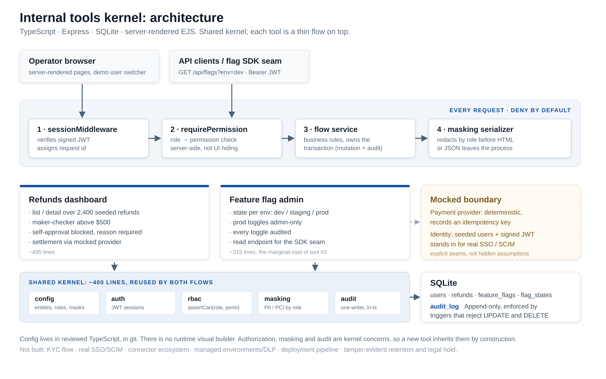

<!-- _class: title -->
<!-- _paginate: false -->

Internal tools · build vs buy

# Replace Power Apps — narrowly

**Build only the tools you actually use. One app at a time.**

---

## The situation

### What Power Apps sells you

- Identity: Entra, SSO, SCIM
- Connectors to the rest of the business
- Workflow automation and approvals
- Managed environments, DLP, admin controls
- Deployment lifecycle
- **Audit posture your auditors already accept**

### What this company uses

- **Three** internal workflows: KYC queue, refunds dashboard, feature-flag admin
- All **engineering-owned**, ~60 engineers
- No non-engineer maker community
- No connector sprawl

~$250K/year buys a citizen-developer program. You're running three apps.

---

<!-- _class: diagram -->

---

## The demo

> Can a reviewer request a high-value refund, can the system **enforce separation of duties**,
> **require a reason**, and leave an **audit trail you'd hand to an auditor**?

### Refunds — the hard one

$820 request parks unpaid · self-approval **blocked server-side** · second approver must give a reason · full history with actor, role, before/after · viewer sees masked PII **in the API response**

### Flags — the reuse proof

Same authorization and audit machinery · prod toggles admin-only · **~495 lines** for refunds, **~215** for the second tool

[play recorded walkthrough]

---

## What it proves — and what it doesn't

### Replicated

- Server-side authorization on every mutation
- Role-based field masking
- Maker-checker with required reason
- Append-only audit + per-record history
- Reusable list/detail screens
- Explicit mocked integration seams

### Not replicated

- Visual builder, Power Automate, connectors
- Real SSO / SCIM, DLP, managed environments
- Deployment pipeline, production ownership
- **Compliance-grade audit evidence** — append-only ≠ tamper-evident; no retention or legal hold
- Local SQLite; no security review

Devin accelerated the research, scaffolding, tests, docs and review. The architecture and security calls are mine to defend.

---

## Economics, honestly

### 1 · Confirm the $250K

At list pricing it implies **~1,000 seats** — which doesn't match 3 apps and 60 engineers. Likely bundles automation, premium connectors, capacity, or an enterprise commitment.

**Retiring the apps may retire less spend than expected.**

### 2 · Ownership never retires

Devin changes build cost, not ownership cost: **0.25–0.5 FTE permanently** for patching, auth changes, audit requests, on-call.

**Compare net, not gross.**

Build still wins if the usage stays narrow and the retireable spend is real.

---

## Recommendation and pilot

### Migrate app by app

1. **Feature flags first** — engineering-owned, no customer PII
2. **Refunds second** — only after security, finance and audit review; it moves money
3. **KYC last, or never** — PII, vendor integration, regulated recordkeeping

### Pilot: 2–4 weeks

Feature-flag admin, **one engineering team, in production**. Real SSO group→role mapping, real DB, CI/CD, observability, audit retention, named owner and SLA.

**Succeeds if:** every mutation audited · prod changes role-gated · SSO mapping works · security review clean · **retired spend > ownership cost**

---

<!-- _class: close -->
<!-- _paginate: false -->

# Don't build Power Apps.

**Build the smaller internal tools platform this company actually needs.**

Narrow usage, a real kernel, and a staged migration — decided on pilot evidence in a month, not on a platform bet.
